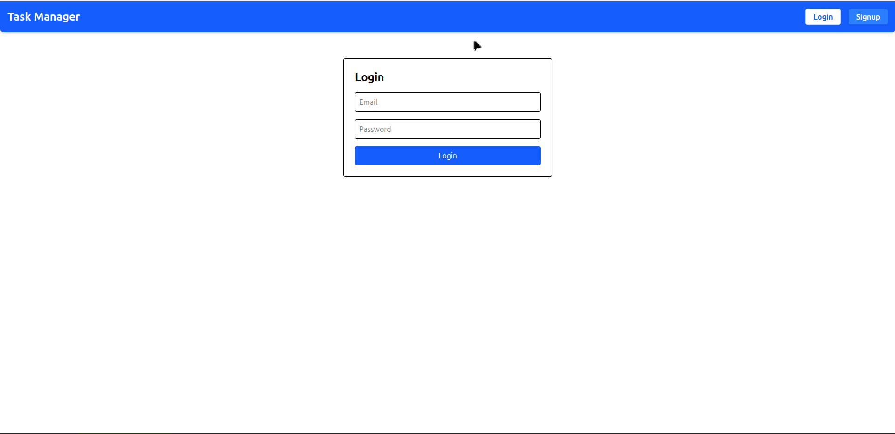
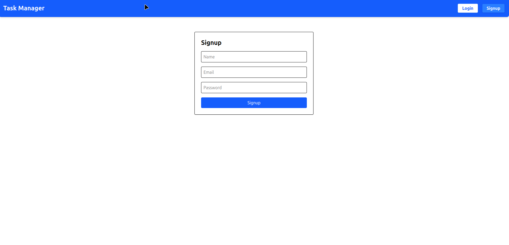
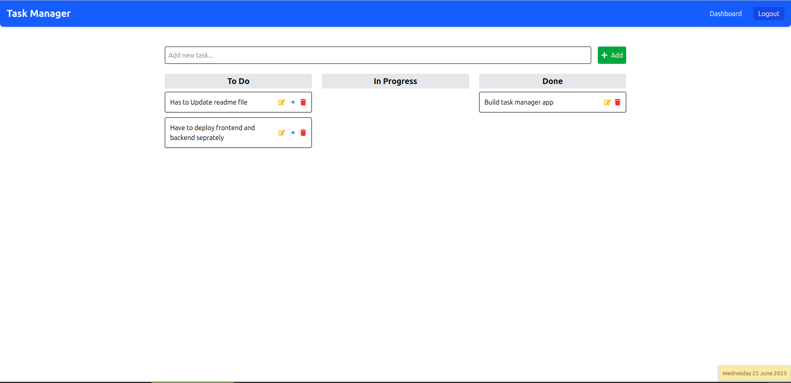

# 🖥️ Task Manager Frontend

This is the frontend interface of the **Task Manager Web App**, built with **Vite + React**, styled using **Tailwind CSS**, and connected to a **Node.js/Express + PostgreSQL** backend via **Axios**.

It allows users to:
- Signup/Login
- Create, edit, and delete tasks
- Move tasks through status stages: `To Do → In Progress → Done`

---

## 🧱 Tech Stack

- **Frontend**: React 19, Vite 6
- **Styling**: Tailwind CSS
- **Routing**: React Router DOM
- **API Calls**: Axios
- **Toasts**: React Hot Toast
- **Icons**: React Icons

---

## 🖼️ Screenshots

| Login Page | Signup Page | Dashboard |
|------------|-------------|-----------|
|  |  |  |

---

## 🔧 Getting Started

### 1. Clone the repository

```bash
git clone https://github.com/gitsofakshay/task-manager-frontend.git
cd task-manager-frontend
```
### 2. Install dependencies

```bash
npm install
```
### 3. Environment Setup
Create a .env file in the root:

```env
VITE_API_BASE_URL=https://your-backend-url.onrender.com/api
```
Replace the URL with your actual deployed backend endpoint.

### 4. Start the development server
```bash
npm run dev
```
Open the app in your browser: http://localhost:5173

---

## 📁 Project Structure

```pgsql
task-manager-frontend/
├── public/
│   ├── login-page.png
│   ├── signup-page.png
│   └── dashboard-page.png
├── src/
│   ├── api/axios.js
│   ├── utils/auth.js
│   ├── components/Navbar.jsx
│   ├── pages/
│   │   ├── Login.jsx
│   │   ├── Signup.jsx
│   │   └── Dashboard.jsx
│   ├── App.jsx
│   └── main.jsx
├── .env
├── package.json
└── tailwind.config.js
```
---

## 🚀 Features
- 🔐 Authentication: Login/Signup with JWT

- ✅ CRUD Tasks: Create, read, update (status & title), delete

- 📊 Task Status: To Do → In Progress → Done

- 🖌️ Responsive UI: Tailwind CSS

- 💬 User Feedback: Toast notifications

---


## 🧑‍💻 Author
Akshay Raj Kushwaha


## 🪪 License
Licensed under the ISC License

---
